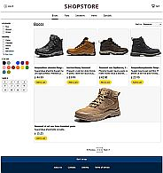
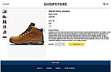
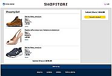
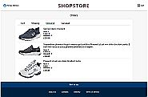

# SHOPSTORE

The project demonstrates the architecture and functionality of a **small online store** including catalog browsing, product pages, authentication, cart management, and order processing.

It was created to showcase frontend architecture, accessibility, testing, and clean code practices.

The frontend built with **HTML, CSS, JavaScript, TypeScript, React, React Router**.

The backend is emulated using **MirageJS**.

Testing: **Jest, React Testing Library**.

Code Quality: **ESLint**

---

## Live Demo

**Demo:**

https://setfolder.github.io/shopstore-demo/

**Video demo**

https://youtu.be/Lx5rRlqsQkQ

---

## Screen Shots

---

## Features

### Product Catalog

- Dynamic catalog loading
- Product characteristics automatically become product groups and filter options
- Unlimited product groups and filter options
- Sorting options (price)

### Product Page

- Detailed product information
- Bookmarkable product URLs

### Authentication

- User registration
- Login with email and password
- Protected routes for cart and user settings

Demo mode allows login with **any valid email and password**.

### Cart

- Add products to cart and remove from it
- Review delivery and payment
- Payment result screen

### Orders

- Cart
- Shipping
- Delivered
- Cancelled

### User Settings

Display User Settings from server

### Responsive Design

The application supports all screen sizes.

### Accessibility

The application supports:

- screen readers
- ARIA attributes
- large fonts and contrast

---

## Installation

### Requirements

- Node.js
- npm
- Git

### Clone the repository

git clone https://github.com/setfolder/shopstore.git

### Install dependencies

npm install

### Run the application

npm start

### Run the application for local network

npm run net

Then open the local server address on another device.

---

## Deployment

**Build the static website:**

npm run build

A **dist** folder with the website will be generated.

To disable MirageJS in production:  delete the **.env.production** file before deployment.

---

## Backend Integration

The project assumes a real backend containing:

- products data
- user data
- orders information

Currently MirageJS emulates API behavior.

The application can be connected to:

- REST API
- database or data files based backend
- inventory systems

---

## Intentional Limitations

- The project does not include a real backend.
- Product list loads fully instead of paginated loading.
- The number of products per page is hardcoded.
- Images are not lazy-loaded.
- User settings are read-only.
- Delivery time is fixed instead of fetched from API.
- No visual notification when adding items to cart.

---

## License

The project is open source.

You are free to use the code.

When using any part of the code, please credit the author Serhii Voznytsia.

---

## Disclaimer

The application is provided "as is", without warranty of any kind. Use it at your own discretion.